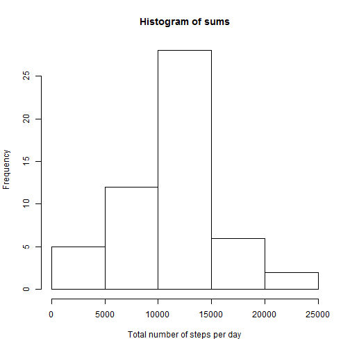
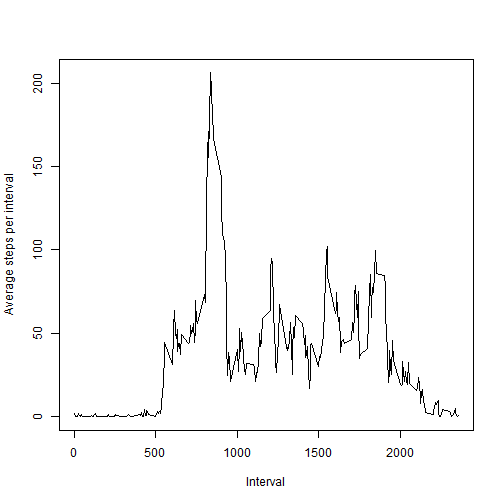
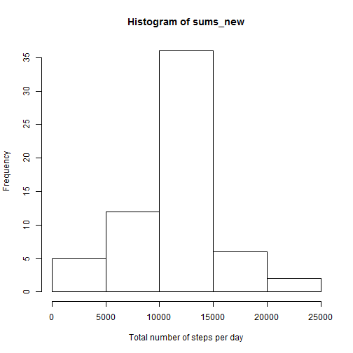
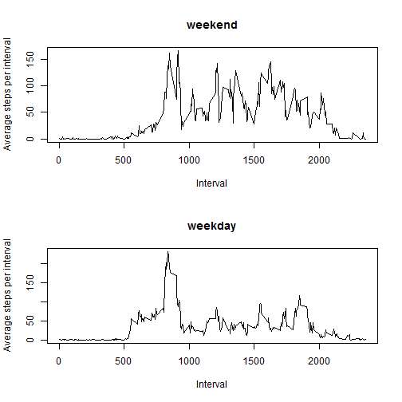

## Loading and preprocessing the data
* read the data, store in variable tab
* steps and interval are numeric values, date is date object

```r
tab <- read.csv("activity.csv", stringsAsFactors=FALSE)
tab$steps <- as.numeric(tab$steps)
tab$interval <- as.numeric(tab$interval)
tab$finalDate <- strptime(tab$date, "%Y-%m-%d")
```
## What is mean total number of steps taken per day?
* Generate a histogram of total number of steps per day

```r
sums <- sapply(split(tab, tab$date), function(x) sum(x[,1]))
hist(sums, xlab="Total number of steps per day")
```

 

```r
sums <- sums[!is.na(sums)]
```
* The mean of total number of steps per day is

```r
mean(sums)
```

```
## [1] 10766.19
```
* The median of total number of steps per day is

```r
median(sums)
```

```
## [1] 10765
```
## What is the average daily activity pattern?
* Generate a time series plot of the 5-minute interval (x-axis) and the average number of steps taken, averaged across all days (y-axis)

```r
l <- split(tab, tab$interval)
avgs <- sapply(l, function(x) {y<-x[!is.na(x[,1]),1]; mean(y)})
avg_mat <- cbind(names(l),avgs)
plot(avg_mat[,1], avg_mat[,2], type="l", xlab="Interval", ylab="Average steps per interval")
```

 

* On average across all the days in the dataset, the following 5-min interval contains the maximum number of steps.

```r
avg_mat[avg_mat[,2]==max(as.numeric(avg_mat[,2])),1]
```

```
## [1] "835"
```
## Imputing missing values
* Calculate and report the total number of missing values in the dataset

```r
sum(is.na(tab$steps) | is.na(tab$interval) | is.na(tab$date))
```

```
## [1] 2304
```
* Fill the missing values with average of that interval
* Make a new data frame called df to store same data, but the missing value replaced

```r
n = dim(tab)[1]
df <- data.frame(steps=numeric(n), date=character(n), interval=numeric(n))
for (i in 1 : n) {
    if (is.na(tab[i,1])) {
        df$steps[i] <- as.numeric(avg_mat[toString(tab[i,3]),2])
    } else {
        df$steps[i] <- tab[i,1]
    }
}
df$date <- tab$date
df$interval <- tab$interval
```
* Make a histogram of the total number of steps taken each day

```r
df$steps <- as.numeric(df$steps)
sums_new <- sapply(split(df, df$date), function(x) sum(x[,1]))
hist(sums_new, xlab="Total number of steps per day")
```

 

* The new mean is

```r
mean(sums_new)
```

```
## [1] 10766.19
```
* The new median is

```r
median(sums_new)
```

```
## [1] 10766.19
```
* As we can see, the average did not change.  The median change a bit
## Are there differences in activity patterns between weekdays and weekends?
* Add a new column to specify weekdays or weekend

```r
df$finalDate <- strptime(df$date, "%Y-%m-%d")
isWeekday <- function(x) {
    s <- weekdays(x)
    if (s == "Saturday" | s == "Sunday") return("weekend")
    return("weekday")
}
for (i in 1 : n) {
    df$weekday[i] <- isWeekday(df$finalDate[i])
}
```
* Time series plot on weekday/weekend 

```r
par(mfrow=c(2,1))
weekday <- subset(df, df$weekday == "weekday")
weekend <- subset(df, df$weekday == "weekend")
l <- split(weekend, weekend$interval)
avgs <- sapply(l, function(x) {y<-x[!is.na(x[,1]),1]; mean(y)})
avg_weekend <- cbind(names(l),avgs)
plot(avg_weekend[,1], avg_weekend[,2], type="l", xlab="Interval", ylab="Average steps per interval", main="weekend")
l <- split(weekday, weekday$interval)
avgs <- sapply(l, function(x) {y<-x[!is.na(x[,1]),1]; mean(y)})
avg_weekday <- cbind(names(l),avgs)
plot(avg_weekday[,1], avg_weekday[,2], type="l", xlab="Interval", ylab="Average steps per interval", main="weekday")
```

 
